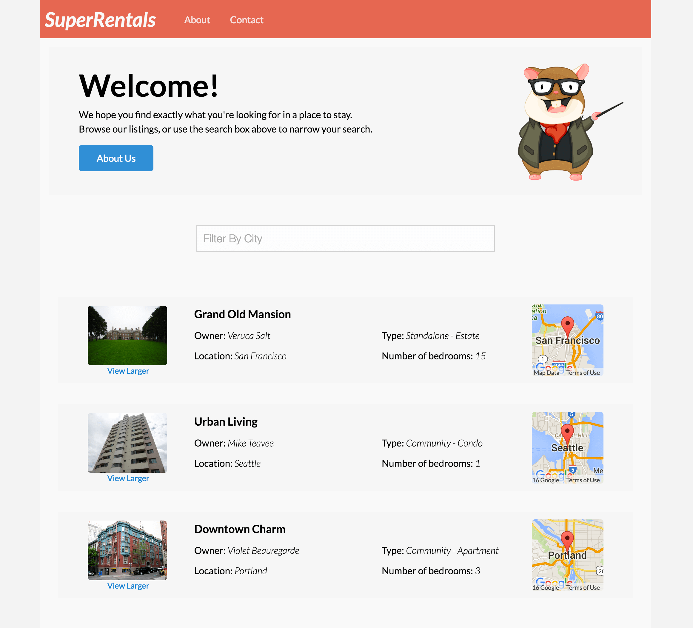

We believe the best way to learn is to practice.
So let's build an application while we try to learn Ember.
It will be for a property rental business called Super Rentals.
Super Rentals has a collection of apartments in various cities around the world, which they allow users to explore and book.
The application

More importantly, this Tutorial is meant to introduce core Ember concepts, and creating a professional looking application allows us do so.

Here's a look at the desired application before we get started

### Objectives

During the tutorial we'll learn how Ember uses URLs as the primary application navigation mechanism.
We'll learn how to define and use them to help our users navigate to other parts of our application.
We'll also learn how to load data into our app.

We'll build our templates with [Handlebars](http://handlebarsjs.com), and later on we'll discover the incredible power of composing our template out of units called, you guessed it, components.
Last but not the least, we need to be able to test our application to make sure it works the way it is supposed to.
For that we'll develop in a [Test-Driven Development](https://en.wikipedia.org/wiki/Test-driven_development) fashion, taking advantage of the testing facilities Ember provides out of the box to.

The complete working code for Super Rentals lives here: [https://github.com/ember-learn/super-rentals](https://github.com/ember-learn/super-rentals). If you get stuck at any point during the tutorial feel free to check it out.

That said, let's begin by [creating the app](ember-cli).
